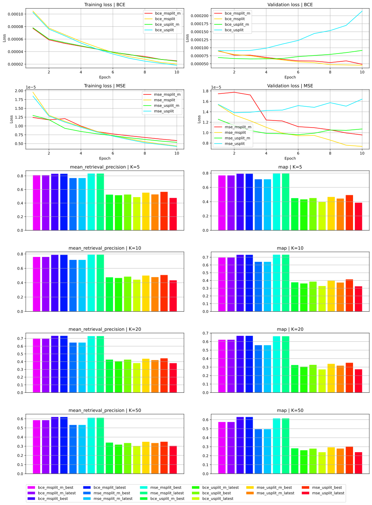
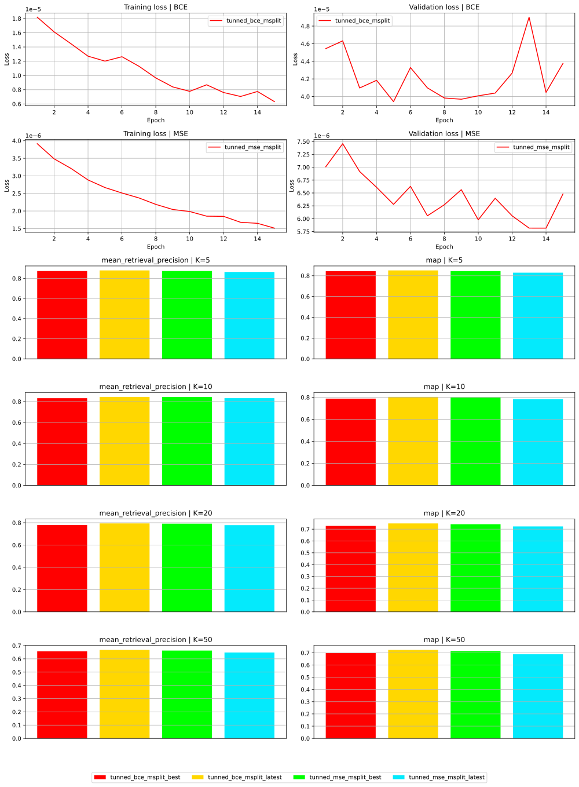
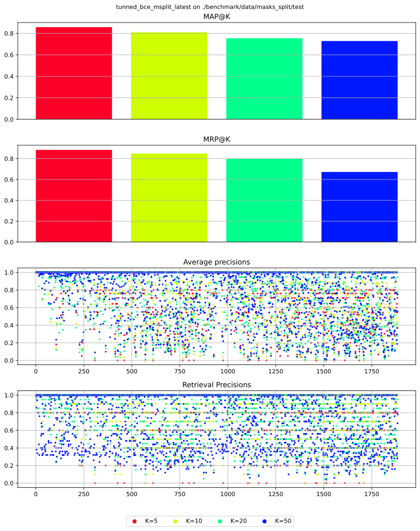
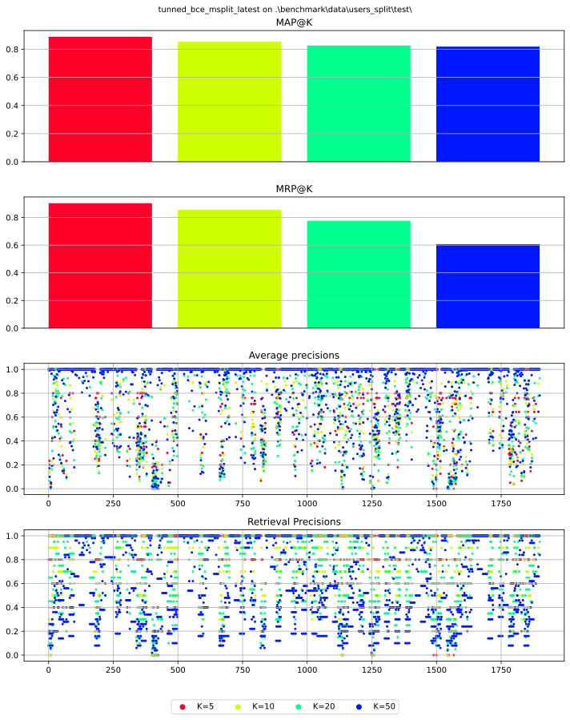

# Report

for PMLDL Assignment 2, Innopolis University

by Dmitry Beresnev (B20-AI, <d.beresnev@innopolis.university>)

## Introduction

The given task is to build model(s) for solving recommendation task: suggest some movies to the user based on user's gemographic information (age, gender, occupation, zip code) and favorite movies (list of movie indices).
Firstly, I propose a way to generate datasets with different splitting mechanism for model training and evaluation based on initial MovieLens-100K dataset.
Secondly, I describe and compare several solution model approaches, which differs on loss function, training datasets and using a mask in the loss function.
Finally, I select the best models based on MAP@K and MRP@K metrics, fine-tune them and compare final metrics.
Moreover, I propose a benchmark for easy models evaluations together with script for real-time interaction with considered models.

In this report I describe and compare considered model solutions as well as the training process and evaluation metrics.
Also I explain the way I analyze and pre-process given dataset and the reasons behind such choices.
At the end I make a conclusion about work what have been done during this assignment.

## Data analysis

### EDA

Initial MovieLens-100K datasets consist of 943 users, 1682 movies and 100k records with user, movie and rating. Also it includes 19 genres and occupations.

During assignment solution, I have done 2 EDA iterations, and the second one is basically
based on the first. However, in this section I describe only techniques I came up with
during the second (and final) EDA iterations, as only them are used for the final solution implementation. Both EDA iterations can be easily found in the `1.0-data-exploration.ipynb` and `1.1-data-exploration.ipynb` notebooks.

As the task is to use user gemographic information, I decided to encode these features in the following way:

- Divide `age` by 100 (as the maximum user age in the dataset is not greater than 80)
- Substitute `gender` "M" with 1 and "F" with 0
- Substitute `occupation` with it index from the initial dataset

I decided to drop `zip_code`, as it is quite hard to encode this field and not to loose relevant geographical information.

### Dataset building

In addition to the basic user gemographic information described above, I decided to use the weighted genre ratios of watched user films. These ratios are calculated for each user and movie pair as following: I construct genres ratios vector, where for each genre I take movie rating if the movie has such genre and 0 otherwise. Then for each user I sum such vectors for every watched movie and normalize it. For example, suppose user X has watched movies A and B, and give them ratings 3 and 5 correspondingly. Also A has [0, 1, 0] genres vector (suppose only 3 genres) and B - [0, 1, 1]. Then the genre ratios for user X are ([0, 1, 0]\*3 + [0, 1, 1]\*5) / (2\*5) = [0, 0.8, 0.5]. Here I normalize by division on (2\*5) as use X has watched 2 films, and the maximum rating can be 5.

Also, I include the vector of movie ratings (rating is 0 if the user did not watch movie) in the final feature vector. Therefore, final feature vector has length 3 + 19 + 1682 = 1704 (3 - for gemographic features, 19 - for weighted genre ratios, and 1682 - for movie ratings vector).

Next I introduce the masking technique and its usage for dataset building.

To generate dataset I need to generate input vector (feature vector) and target vector. The idea of masking is the following: for specific user let us take movie ratings vector and mask some of watched movies, i.e. put for them rating 0. After calculating weighted genre ratios for this new masked movie ratings vector, we can easily build a feature vector as concatenation of user's gemographic features, calculated weighted genre ratios and normalized masked movie ratings vector. As target vector I use initial (without mask) user's movie ratings vector.

For final datasets, for each user I generate 4 masks for each percent of masking (how many movies should be masked). I use the following making percents: 0.2, 0.4, 0.6, 0.8 and 0.9. For example, mask percent = 0.8 means that I mask 90% of users watched movies. As a result, for each user I have 4\*5 = 20 pairs of input feature vector and target vector.

Finally, I introduce the notion of splitting - the way how all the data is split to the train and test set. I build tow different datasets with following splittings:

- **masks_split** splits train/test datasets on different **masks**. All users are present in both datasets
- **users_split** splits train/test datasets on different **users**. In the test dataset are only users, which are not in the train dataset. In other words, two sets are disjoint on users.

The main reason about different splittings is to test how models will behave with unseen users and unseen masks. As we will see further, the metrics of models trained on different splits are also quite different.

Both datasets can be found in the `data/interim/masks_split` and `data/interim/users_split` folders respectively.

## Model Implementation

Previous section has already described the input feature vector and target (output) vector for the model. However, the next question arise - what loss function to use? On the one hand, we can think about the problem as about regression problem: model predicts ratings for each movie, so we can just take MSE (Mean Squared Error) as loss function. On the other hand, we are not really interested in precise ratings, we want model to predict the same movies that were masked. In such case, we can choose BCE (Binary Cross Entropy) as loss function. Personally, I cannot give a clear preference to any of these methods.

Moreover, there is another important question - on which part of model output we want to calculate loss? Remember, we have some movie ratings unmasked in the input feature vector. So what is the best way to calculate loss - on full output and target vectors, or on these parts of output and target vectors that correspond to previously unseen (masked and truly unseen) movies?

In addition to these questions we have two different splittings we want to train our models on.

Considering all of the above, I decided to train all the model combinations of the following hyper-parameters:

- Loss function (MSE or BCE)
- Splitting used for training and validation (masks_split or users_split)
- Way of calculation loss: only on masked parts or on full parts of output and target vectors (masked or not)

Regardless of the choice of these hyper-parameters, I use the following model architecture

- Input size is 1704, output size is 1682
- 3 consecutive fully-connected (FC) layers with 1024 neurons each + 1 output layer
- ReLU activation function on each layer except the last one - on the tail the Sigmoid is used, as the normalized ratings should be in the range [0, 1]
- 2 dropout layers with probability 0.1 each: one after the first FC layer, one after the second FC layer

Also I initialize parameters of the model using Xavier uniform method.

## Model Advantages and Disadvantages

The main advantages of the model are the followings:

- Simplicity - small training and testing time
- Compactness - model weights take up little disk space
- Efficiency - such architecture can handle quite complex input-output connections
- Flexibility - as explicit ratings are predicted, the model can used in different scenarios and with different loss functions

However, there are several disadvantages of the proposed model:

- Sparse input vector - most of the movie ratings are almost always 0
- Input data inconsistencies - most of the input data is dedicated to the movies information, while users' gemographic data is represented by only 3 numbers
- Huge output dimension - it may result in worse loss back propagation

## Training Process

I train all models on 4GB GPU and Python 3.11.
The training-validation ratios for both splittings are 0.9 and 0.1 respectively. Batch size is set to 32. Optimizer is Adam with learning rate 1e-3.

As it is stated above, I decided to train every possible combinations of models (8 models in total).
After training, I calculate metrics (check out Evaluation section) and based on them choose several bests models. I will refer to this stage as to comparison stage.

The next stage is tunning stage: I additionally train the best models from comparison stage few more epochs and measure final metrics.

Epochs number for comparison stage is 10, and for tunning stage - 15.

During training models on the comparison stage, I save them to the folder `models/` using the following name convention to easily identifying its hyper-parameters: **{loss}\_{split\}\_{masked}\_{checkpoint}**, where

- {loss} identifies loss function used during training: `bce` or `mse`
- {split} identifies splitting used during training: `msplit` is for masks split, and `usplit` - for users_split
- {masked} identifies whether loss was computed on on masked parts of output and target vectors only during training: `m` if yes, and omitted otherwise
- {checkpoint} identifies type of saved model: `latest` is for the final model after all epochs trained, and `best` - for the model which was best in terms of loss function on validation dataset

Models, which are results of tunning stage, can be found in the same folder and have the save naming convention, but also has `trained_` prefix.

Comparison stage is performed in `2.0-models-comparison.ipynb` notebook, and tunning stage - in `3.0-final-models-tunning.ipynb`.

Results (as metrics and plots) of both stages can be found in `data/results`. Tunning stage results files have the prefix `tunned_`.

## Evaluation

To evaluate models I use the following metrics:

- [MAP@K](https://machinelearninginterview.com/topics/machine-learning/mapatk_evaluation_metric_for_ranking/) - Mean Average Precision on K
- [MRP@K](https://pytorch.org/torcheval/main/generated/torcheval.metrics.functional.retrieval_precision.html) - Mean Retrieval Precision on K
- Mean Top Intersections on K - if I take top K items from target and predicted data, how many of them will intersect

The main metrics are MAP@K and MRP@K, as they are usually used for recommendation systems evaluation. I do not use MSE loss here, as, firstly, it is not used by models with BCE loss function during training, so it has no sense for them, and secondly, because the main goal of original task is the recommend some relevant movies and not to predict ratings.

For metrics calculation the following list of Ks is used by default: 5, 10, 20, 50.

Mentioned metrics are used both on comparison and tunning stages. Also same metrics are computed in `benchmark/evaluate.py`. For comparison and tunning stages I also save and plot training losses and validation losses, to show presence or absence of convergence for the corresponding loss.

I save more metrics in corresponding .json files: full lists of average precisions on k and retrieval precisions on k for each validation data point, precision and recall metrics, etc.

## Results

Results after the comparison stage are the following (Fig. 1):

- Models trained on the masks split datasets show significantly better performance in terms of both MAP@K and MRP@K for all K
- Models with loss computations on full target and output vectors (without masks) usually show better performance in terms of both MAP@K and MRP@K for all K. Difference in performance for models with BCE loss is bigger tah for models with MSE loss
- Validation loss for models trained on the users split datasets either show very slight decrease, or even increase
- Models with `_best` postfix show usually greater or the same performance than corresponding models with postfix `_latest`

AS a result, best models chosen for tunning stage are `bce_msplit_latest` and `bce_msplit_best`.

Results after the tunning stage are the following (Fig. 2):

- Model with MSE loss demonstrate more stable convergence
- All the models overcome 0.8 MAP@K score for K = 5, 0.7 MAP@K score for K = 10 and 20, 0.65 MAP@K score for K = 50. It is very good results

The overall best model is `tunned_bce_msplit_latest` with the followng metrics:

- MAP@5 = 0.85, MRP@5 = 0.88
- MAP@10 = 0.80, MRP@10 = 0.84
- MAP@20 = 0.75, MRP@20 = 0.79
- MAP@50 = 0.72, MRP@50 = 0.67

You can evaluate this and other models using `benchmark/evaluate.py` script. You also can interact with any of the mentioned models and ask it to recommend you some movies using `benchmark/interactive.py`.

Clearly, results for model trained on users split dataset show that model may not be very successive in recommending movies fro previously unseen users. Of course, there are also space for improvement - and there is model disadvantages section as proof. However, obtained results are quite optimistic, despite the solution model is not very complex.

## Figures

|  |
| :-------------------------------------------------------------: |
|             **Fig. 1** Results of comparison stage              |

|  |
| :-----------------------------------------------------------------: |
|                 **Fig. 2** Results of tunning stage                 |

|  |
| :-------------------------------------------------------------------------------------------------------: |
|                 **Fig. 3** Final solution model results on masks split validation dataset                 |

|  |
| :-------------------------------------------------------------------------------------------------------: |
|                 **Fig. 4** Final solution model results on users split validation dataset                 |
